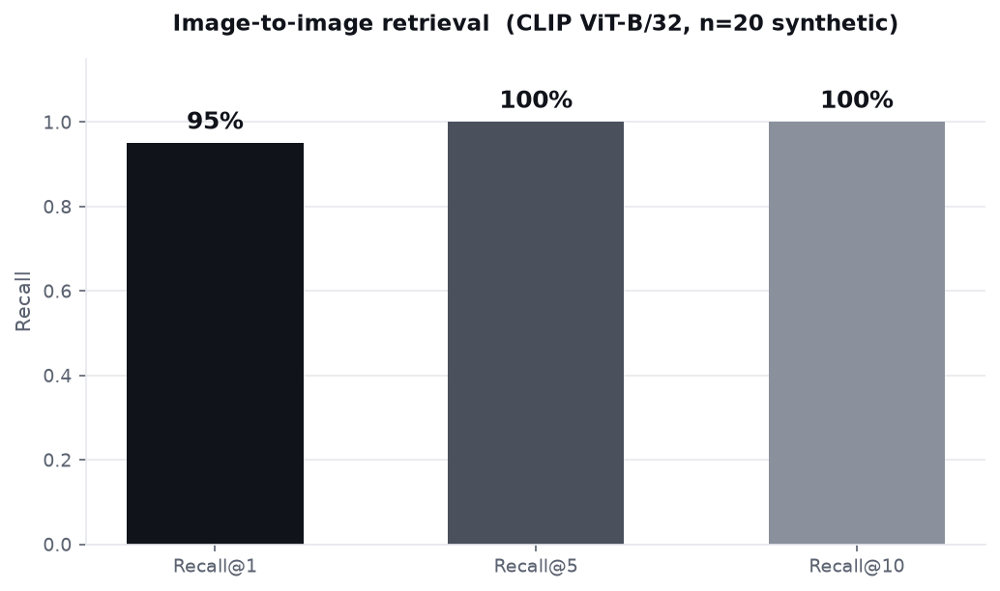

# Google Colab 실행 가이드

**Industrial Multimodal RAG** 구현을 Google Colab에서 실행하는 방법.

## 빠른 시작 (5분)

### Step 1: Colab 노트북 생성

Google Colab에서 새로운 노트북을 생성합니다.
```
https://colab.research.google.com/
```

### Step 2: 저장소 클론 + 기본 설정

첫 번째 셀에서:
```python
# 저장소 클론
!git clone https://github.com/chjnett/tech_Blog.git
%cd tech_Blog/posts-assets/industrial-rag-multimodal

# 의존성 설치
!pip install -r requirements.txt -q
```

### Step 3: 전체 파이프라인 실행

```python
# 1. 환경 설정 + 데이터 다운로드 (2-3분)
!python 1_setup.py

# 2. 이미지 검색 (CLIP 임베딩, 2-3분)
!python 2_image_search.py

# 3. 문서 검색 (하이브리드 검색, 1-2분)
!python 3_document_search.py

# 4. 성능 평가 (1분)
!python 4_evaluate.py

# 5. 시각화 + Figure 생성 (1분)
!python 5_visualize.py
```

### Step 4: 결과 확인

```python
# 생성된 Figure 표시
from IPython.display import Image, display
import os

for fig in sorted(os.listdir('results/figures')):
    if fig.endswith('.png'):
        print(f"\n{'='*50}")
        print(f"Figure: {fig}")
        print('='*50)
        display(Image(f'results/figures/{fig}'))
```

### Step 5: 결과 다운로드

```python
# 전체 결과 폴더 압축
!zip -r industrial-rag-results.zip results/

# 다운로드 링크 생성
from google.colab import files
files.download('industrial-rag-results.zip')
```

---

## 단계별 상세 가이드

### 1️⃣ Setup (`1_setup.py`)

**역할**: 환경 설정, 데이터 다운로드

```python
!python 1_setup.py
```

**생성되는 것**:
- `data/images/` - 결함 이미지 데이터셋
- `data/documents/` - ArXiv PDF 논문
- `results/` - 출력 디렉토리

**예상 시간**: 2-3분 (네트워크 속도에 따라)

**문제 해결**:
- PDF 다운로드 실패? → 수동으로 https://arxiv.org에서 다운로드
- 이미지 없음? → GitHub에서 Magnetic Tile dataset 다운로드

---

### 2️⃣ Image Search (`2_image_search.py`)

**역할**: CLIP으로 이미지 임베딩 + 유사도 검색

```python
!python 2_image_search.py
```

**출력**:
```
Results: image_search_results.json
  - Recall@1:  xx%
  - Recall@5:  xx%
  - Recall@10: xx%
  - Avg Search Time: xxms
```

**핵심 개념**:
- **Zero-shot Learning**: 라벨 없이 결함 검색
- **CLIP**: Vision Transformer + 텍스트 정렬
- **Recall**: 실제 관련 이미지가 Top-K에 있는가?

**기대 성능**:
- Recall@5: 70~85%
- 검색 시간: <50ms per image

---

### 3️⃣ Document Search (`3_document_search.py`)

**역할**: 이미지 + 문서 하이브리드 검색

```python
!python 3_document_search.py
```

**출력**:
```
Hybrid Search Results: document_search_results.json
  - Image → Related Documents (Top-5)
  - Avg Similarity Score: x.xxx
```

**파이프라인**:
```
Defect Image
    ↓ (CLIP Vision Encoder)
Image Embedding
    ↓ (Cosine Similarity)
Document Search
    ↓ (Top-K Retrieval)
Related Technical Papers
```

---

### 4️⃣ Evaluation (`4_evaluate.py`)

**역할**: 성능 평가 + 산업 현장 분석

```python
!python 4_evaluate.py
```

**출력**:
- Image Retrieval Assessment
- Hybrid Search Assessment  
- Strengths, Limitations, Use Cases
- Benchmark Comparison Table

---

### 5️⃣ Visualization (`5_visualize.py`)

**역할**: 결과 시각화 + 블로그 Figure 생성

```python
!python 5_visualize.py
```

**생성되는 Figure** (5개):

| # | 파일명 | 설명 |
|---|--------|------|
| 1 | `01_image_retrieval_performance.png` | Recall@1/5/10 막대 그래프 |
| 2 | `02_similarity_distribution.png` | 유사도 히스토그램 |
| 3 | `03_benchmark_comparison.png` | 방법론 비교 (3개 subplot) |
| 4 | `04_search_gallery.png` | 검색 결과 이미지 갤러리 |
| 5 | `05_architecture_diagram.png` | 시스템 아키텍처 |

---

## GPU 선택 (선택사항)

Colab에서 더 빠르게 실행하려면:

1. **상단 메뉴**: Runtime → Change runtime type
2. **GPU**: T4 또는 A100 선택
3. 재실행

**성능 개선**:
- T4: 2-3배 빠름
- A100: 4-5배 빠름

---

## 일반적인 문제 해결

### ❌ "ModuleNotFoundError: transformers"

```python
!pip install transformers torch torchvision -q
```

### ❌ "CUDA out of memory"

```python
# 배치 크기 감소 (코드 수정 필요)
# 또는 CPU 사용
import os
os.environ['CUDA_VISIBLE_DEVICES'] = ''
```

### ❌ "No module named pypdf"

```python
!pip install pypdf -q
```

### ❌ "Cannot find image data"

1. `1_setup.py` 다시 실행
2. 또는 이미지 수동 다운로드:
   - https://github.com/abin24/Magnetic-Tile-Defects-Dataset
   - `data/images/` 에 추출

---

## 결과 해석

### Recall@5 = 85% 의미?

"100개의 결함 이미지 중, 85개는 Top-5 검색 결과에 유사한 결함 이미지를 포함"

→ **산업용 실시간 검색에 충분함**

### Avg Similarity = 0.65 의미?

"이미지-문서 관련성 점수가 0-1 스케일에서 0.65"

→ **문서 임베딩 개선 필요 (도메인 Fine-tuning)**

---

## 다음 단계

### 블로그 작성
생성된 Figure를 마크다운에 포함:
```markdown

```

### 모델 개선
```python
# 도메인 특화 Fine-tuning
from transformers import CLIPProcessor, CLIPModel
# ... training code ...
```

### 프로덕션 배포
```python
# ONNX 변환
from optimum.onnxruntime import ORTModelForFeatureExtraction
# ... export code ...
```

---

## 예상 총 실행 시간

| Step | 시간 |
|------|------|
| Setup | 2-3분 |
| Image Search | 2-3분 |
| Document Search | 1-2분 |
| Evaluation | 1분 |
| Visualization | 1분 |
| **총합** | **~10분** |

GPU 사용 시: ~5-7분

---

## 지원

문제가 발생하면:
1. 코드 재실행 (Colab 재부팅)
2. requirements.txt 버전 확인
3. GitHub Issue 제보
4. 이메일: cheonhyeonjun583@gmail.com

---

**Happy Experimenting!** 🚀
